# Mechanistic Circuit Comparison of Modular Arithmetic Tasks in Transformers

*Do structurally similar arithmetic tasks converge on the same internal circuit, or do they find independent solutions?*

Modular addition has become a model organism for mechanistic interpretability after Nanda et al. (2023) reverse-engineered the Fourier-feature circuit that small transformers learn under grokking. This project asks whether the closest possible variant, modular subtraction, recruits the same circuit, by training matched 1-layer attention-only transformers on `(a + b) mod 113` and `(a − b) mod 113` and comparing their internal circuits across six analysis phases. The two tasks behave very differently: addition groks in 9/10 valid seeds with mean grokking epoch 489, subtraction in 1/10 (epoch 992); the grokked subtraction model uses an asymmetric attention pattern (Head 2 from-pos_b: `[0.83, 0.02, 0.15]`, z=9.32 against the addition distribution) and shares only one head with the addition consensus circuit (Jaccard = 0.250), and the asymmetric pattern is already present in the memorisation phase (pre-grokking asymmetry 0.916, *higher* than the grokked value of 0.673), meaning grokking sharpens the Fourier basis rather than installing the circuit identity.

## Key Findings

1. **Computation is entirely end-localised.** Logit lens projects each of the six residual stream states (`embed_pos{0,1,2}`, `resid_pos{0,1,2}`) through the unembedding matrix and measures the mean probability assigned to the correct answer. All five intermediate states sit at random chance (~0.009) for every model, then jump only at `resid_pos2` (the final position after attention). Grokked addition seeds land in the range 0.839–0.950, and the single grokked subtraction seed (seed5) reads 0.845, falling well within the addition distribution. The model does not build the answer incrementally across positions or layers; it composes it in one attention step at the answer position.

2. **The tasks use divergent circuits despite sharing one head.** Activation patching at every (head, position) cell, with corruption `b' = (b + 1) % 113`, gives a Jaccard similarity of 0.250 between the addition consensus circuit (cells appearing in the top-3 of ≥7/9 seeds: `(H0, pos_b)` and `(H2, pos_b)`) and the subtraction seed5 top-3 (`(H1, pos_b), (H2, pos_b), (H3, pos_b)`). Subtraction is dominated by Head 1 (LDR=0.59), a head that addition models barely use (mean LDR=0.14). Cross-task patching, where addition activations are injected into the subtraction model's corrupted run, restores 0.31 LDR through Head 1 at pos_b, indicating partial transfer rather than full circuit reuse. Output patching at `pos_a` and `pos_=` is exactly 0.00 across every model: all causal write contribution is at pos_b.

3. **Head 2 attention is categorically different between tasks.** Defining asymmetry as `mean(attn_to_a) − mean(attn_to_b)` from the pos_b destination, addition Head 2 sits at −0.001 ± 0.072 across 9 grokked seeds (essentially symmetric, attending to a and b in roughly equal proportion). Subtraction seed5 reads +0.673 (z=9.32 against the addition distribution), and the two near-miss subtraction seeds register +0.205 (seed2) and −0.916 (seed4). The opposite-direction near-misses are the most striking detail in the entire project: subtraction's basin admits multiple competing attractors, while addition's enforces a single symmetric solution.

4. **Weight-space subspace comparison is at random baseline.** SVD of the per-head OV (`W_V @ W_O`) and QK (`W_Q @ W_K.T`) matrices, followed by Frobenius alignment of the top-5 left singular vectors normalised by √5, returns 0.194 ± 0.024 within the 45 addition pairs and 0.194 ± 0.015 across the 9 addition-vs-subtraction5 pairs for Head 2 OV. The theoretical baseline for two random orthonormal 5-subspaces in d=128 is ≈0.197, so both within-task and cross-task alignments sit on top of pure noise. The residual stream has no canonical basis, so each grokked model implements its circuit in a different rotation; this rotational symmetry is independently confirmed by the Fourier analysis, where each addition seed picks an idiosyncratic frequency set (seed0: {50, 54, 3, 13, 5}; seed1: {1, 23, 2, 46, 0}; seed2: {39, 20, 40, 35, 0}) and the cross-task frequency overlap Jaccard is 0.250. Subtraction OV effective rank (2–3) is consistently lower than addition's (3–9), so the subtraction circuit lives in a tighter subspace even when the alignment metric cannot detect it.

5. **Subtraction's asymmetric attention is a memorisation artefact that partially softens at grokking.** The pre-grokking checkpoint (last epoch where `test_acc < 0.5`, weight L2 distance to grokked = 31.25 for subtraction seed5) shows a Head 2 asymmetry of 0.916, which then *decreases* to 0.673 at the grokked checkpoint and stays there. Fourier concentration (top-3 frequency power as a fraction of total) rises from 0.363 to 0.520 (+0.157) for subtraction seed5 across the same transition, and from 0.578 to 0.737 (+0.159) for addition mean. The pre→grokked patching Jaccard is 0.667 ± 0.236 across addition seeds, with three seeds at 1.0 (top-3 cells unchanged across the transition) and the rest at 0.5. Grokking sharpens the Fourier basis and slightly reorganises which heads dominate, but the circuit identity is largely fixed during memorisation; what changes is the cleanliness of the embedding, not the attention map.

6. **Subtraction is structurally harder to grok under identical conditions.** Under matched hyperparameters (`weight_decay=0.5`, `lr=1e-3`, AdamW, batch 512, identical pair-level split of 6,384 train / 6,385 test), addition reaches 9/10 valid seeds grokked with mean epoch 489 ± 419 and only 1 initialization failure, while subtraction reaches 1/10 with grokking epoch 992, 5 initialization failures, and a final test accuracy distribution of 0.517 ± 0.363. The single grokked subtraction model has lower Fourier concentration at the grokked stage (0.520 vs addition's 0.737), and causal scrubbing (forcing Head 2 attention to `[0.5, 0.0, 0.5]` from pos_b) yields an `asymmetry_partially_causal` verdict: subtraction drops by 0.785, addition controls by 0.606 ± 0.106, ratio 1.29×. The compressed Fourier basis and the fragmented attractor landscape jointly explain why the same architecture finds the addition circuit nine times in ten and the subtraction circuit one time in ten.

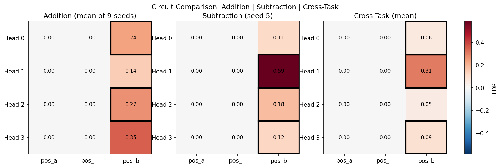
*The three patching heatmaps tell the central comparative story in one image: addition distributes LDR across all four heads at pos_b, subtraction concentrates on Head 1, and cross-task transfer routes through Head 1 of the subtraction model when fed addition activations. Every cell at pos_a and pos_= is exactly 0.00, providing causal evidence by intervention rather than observation that all answer-relevant computation is written to pos_b in a single attention step.*

## Method

### Task and Data

Both tasks operate over integers modulo p=113 (a prime). For each task, the full dataset of 113×113 = 12,769 ordered pairs `(a, b)` is split at the *pair* level (not at the sample level) into 6,384 train and 6,385 test pairs using a fixed seed of 42. The split satisfies four invariants verified by 11 assertion checks: every value of a appears in both splits, every value of b appears in both splits, no `(a, b)` pair appears in both, and the addition and subtraction tasks share the same train/test split exactly. This forces the model to generalise compositionally rather than memorise individual answers, and it ensures the cross-task comparison is on identical inputs. Each input is a 3-token sequence `[a, =, b]` over a vocabulary of 115 (integer tokens 0–112, separator token 113, and an unused padding token 114), and the target is a single integer label.

### Architecture

Every model is a 1-layer, 4-head, attention-only transformer built with TransformerLens (`HookedTransformer`). Configuration: `n_layers=1, d_model=128, n_heads=4, d_head=32, d_mlp=None, act_fn=None, normalization_type=None, d_vocab=115, d_vocab_out=115, n_ctx=3, attn_only=True`. The deliberate omission of MLPs and LayerNorm follows standard practice in mechanistic interpretability for modular arithmetic and keeps the residual stream interpretable for circuit analysis. The model has approximately 60k trainable parameters per seed.

### Training and Grokking Detection

Training uses AdamW with `lr=1e-3, weight_decay=0.5, betas=(0.9, 0.98)`, full-batch shuffled minibatches of size 512, and a maximum of 5,000 epochs. Cross-entropy loss is computed only on the logits at position 2 (the answer position). Grokking is detected by a two-part criterion: a candidate epoch is the first epoch where test accuracy crosses 0.95, and grokking is confirmed if test accuracy remains at or above 0.95 for 50 consecutive epochs. The candidate epoch is recorded as the grokking epoch; the actual checkpoint-saving epoch is `candidate_epoch + 49`. Three checkpoint types are saved per grokked run: `pre_grokking` (the last epoch where test accuracy was below 0.5, captured as a per-epoch CPU-cloned snapshot of trainable parameters only and validated for NaNs), `grokked` (saved at the confirmation epoch with the full state dict), and `final` (saved when training terminates). An initialization failure cutoff stops a run early if `train_acc < 0.50` at epoch 500, and a plateau early-stopping rule terminates a run if the maximum train accuracy over the last 500 epochs has not improved by at least 0.02 over the maximum of the prior 500. The script seeds each run from 0 upward and continues until 10 valid (non-init-failure) runs have been collected per task.

### Analysis Pipeline

Phase 3 (`scripts/03_logit_lens.py`) projects the residual stream at every position before and after attention through the unembedding matrix and reports lens accuracy (mean correct-class probability), argmax accuracy (used as a sanity check against reported test accuracy), and mean rank. Phase 4 (`scripts/04_activation_patching.py`) implements true per-head patching by decomposing `attn_out` via `hook_z @ W_O[h]` rather than naively slicing dimensions: for each (head, position) cell, the source clean per-head contribution replaces the corrupted contribution, the result is summed and added to the corrupted embedding, and the patched logit difference for the answer pair `(c_clean, c_corrupt)` gives the LDR. Phase 5 (`scripts/05_circuit_analysis.py`) computes per-head OV and QK matrices, runs SVD with `full_matrices=False`, and measures subspace alignment as the Frobenius norm of `U1.T @ U2` for the top-5 left singular vectors normalised by √5; effective rank is the participation ratio `(Σs)² / Σs²`. Phase 5b (`scripts/05b_extended_analysis.py`) computes the embedding Fourier spectrum via `rfft(W_E[:113, :], dim=0)`, attention asymmetry from the cached attention pattern at `pattern[:, h, 2, :]`, and causal scrubbing via `model.run_with_hooks` with a hook that overwrites `pattern[:, 2, 2, :]` to a forced row. Phase 6 (`scripts/06_circuit_evolution.py`) discovers seeds by filesystem scan, loads pre-grokking checkpoints with `strict=False` (the saved trainable-parameter state omits `attn.mask` and `attn.IGNORE` buffers, which would otherwise produce NaN under `(-inf) - (-inf)` in the L2 diff), and reruns the patching, asymmetry, and Fourier analyses at each of the three checkpoint stages with the same 500-example subset per seed.

## Results

### Training Dynamics

| Task        | Seeds Grokked | Mean Grokking Epoch | Final Test Acc  | Init Failures |
| ----------- | ------------- | ------------------- | --------------- | ------------- |
| Addition    | 9/10          | 489 ± 419           | 0.963 ± 0.065   | 1             |
| Subtraction | 1/10          | 992 (n=1)           | 0.517 ± 0.363   | 5             |

The asymmetry is reproducible and survives a hyperparameter sweep. An earlier configuration with `weight_decay=1.0` (the value Nanda et al. (2023) report as the primary driver of grokking in modular arithmetic) was abandoned because subtraction collapsed entirely under it, with high initialization failure rates, oscillatory behaviour near the grokking threshold that prevented the sustained-criterion from being satisfied, and a 0.87 plateau that did not improve across 5,000 epochs. Reducing weight decay to 0.5 was a deliberate methodological choice to recover sufficient grokked subtraction runs for circuit comparison while preserving the qualitative asymmetry; the asymmetry persists at the lower setting, which rules out over-regularisation as the cause. Eleven addition seeds had to be tried (seeds 0–10) to collect 10 valid runs; fifteen subtraction seeds (0–14) were needed to collect the same number of valid runs.

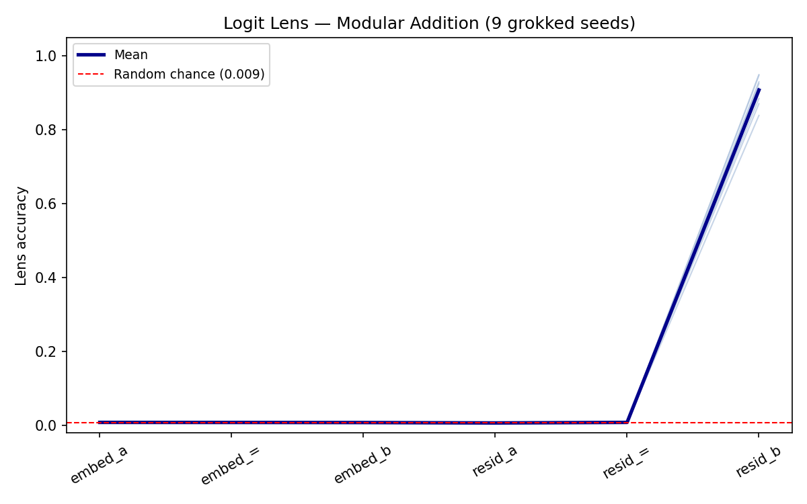
*All 9 grokked addition seeds (light blue) produce near-identical logit lens profiles: flat at random chance through the five intermediate states, then a sharp jump at resid_b. The spread at resid_b (0.839 to 0.950) reflects the seed-to-seed variance in how completely the circuit has formed, not a difference in where computation happens.*

### Logit Lens

| State          | Addition Mean (n=9) | Subtraction seed5 |
| -------------- | ------------------- | ----------------- |
| `embed_pos0`   | 0.0088              | 0.0089            |
| `embed_pos1`   | 0.0086              | 0.0089            |
| `embed_pos2`   | 0.0083              | 0.0086            |
| `resid_pos0`   | 0.0073              | 0.0089            |
| `resid_pos1`   | 0.0090              | 0.0079            |
| `resid_pos2`   | 0.910               | 0.845             |

The five intermediate states are flat at random chance (1/113 ≈ 0.009) for every model, including the separator position after attention. The answer is composed at `resid_pos2` in a single attention step. Subtraction seed5's `resid_pos2` value of 0.845 sits below the addition mean of 0.910 but is still inside the addition range (0.839 to 0.950), so the grokked subtraction model writes its answer with the same kind of confidence as a grokked addition model; what differs is not *whether* the answer is built at pos_b but *which heads* build it.

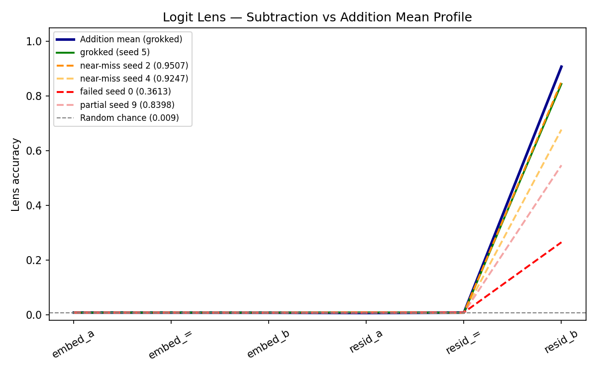
*Addition's mean profile (dark blue) and subtraction seed5 (green) both spike sharply at resid_b. The near-miss subtraction seeds (orange) reach high but insufficient values, and the failed seed (red) barely lifts off the baseline. The shared shape across all curves confirms end-localisation; the differences in final height index how complete the circuit is, not where it lives.*

### Activation Patching

| Head | Addition Mean LDR at pos_b | Subtraction seed5 LDR at pos_b |
| ---- | --------------------------- | ------------------------------ |
| H0   | 0.24                        | 0.11                           |
| H1   | 0.14                        | 0.59                           |
| H2   | 0.27                        | 0.18                           |
| H3   | 0.35                        | 0.12                           |

Addition consensus circuit (cells appearing in the top-3 of ≥7/9 grokked seeds): `(H0, pos_b)` and `(H2, pos_b)`. Subtraction seed5 top-3: `(H1, pos_b), (H2, pos_b), (H3, pos_b)`. Cross-task top-3 (mean of patching addition activations into subtraction): `(H1, pos_b), (H3, pos_b), (H0, pos_b)`. Jaccard(addition consensus, subtraction top-3) = 0.250; Jaccard(addition consensus, cross-task top-3) = 0.250. Cross-task LDR through Head 1 at pos_b: 0.31. The shared head between the two tasks is Head 2, which is also the head where the attention asymmetry diverges most sharply; the heads that *differ* between the tasks (H0/H3 in addition, H1 in subtraction) carry the bulk of the LDR mass for their own task. See the colour heatmap immediately below the Key Findings section for the full visual.

### Circuit Analysis

Mean attention pattern from pos_b for Head 2 (rows are `[to_a, to_=, to_b]`):

| Model              | to_a   | to_=   | to_b   |
| ------------------ | ------ | ------ | ------ |
| Addition mean      | 0.50   | 0.01   | 0.50   |
| Subtraction seed5  | 0.83   | 0.02   | 0.15   |

Subtraction Head 1, the dominant head, attends from the separator position with `[0.74, 0.26, 0.0]` (to_a, to_=, to_b), an anomalous pattern compared to addition's mean Head 1 from-= row of `[0.32, 0.68, 0.0]`. The subtraction model recruits the separator as an information aggregation point in a way no addition model does.

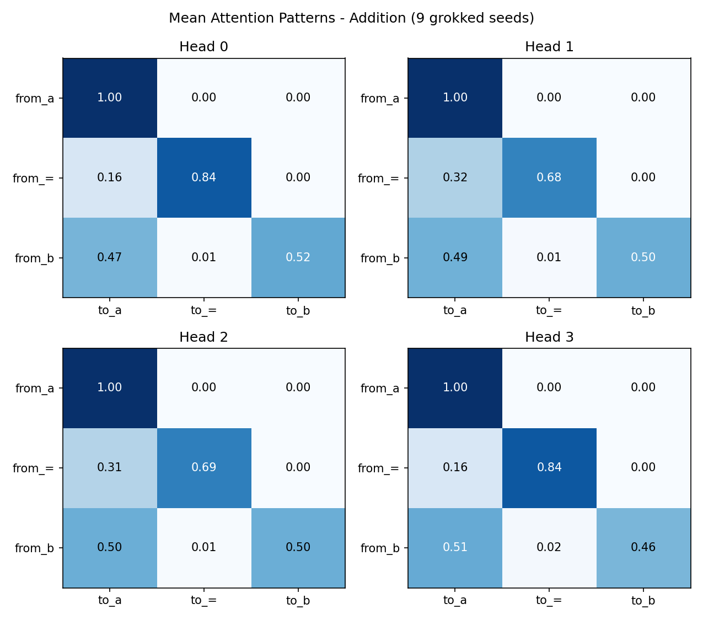
*All four heads attend symmetrically from pos_b: roughly 0.50 to a and 0.50 to b, with negligible weight on the separator. The lower-right cell of each head's pos_b row sits near 0.50, which is the structural signature of the addition circuit.*

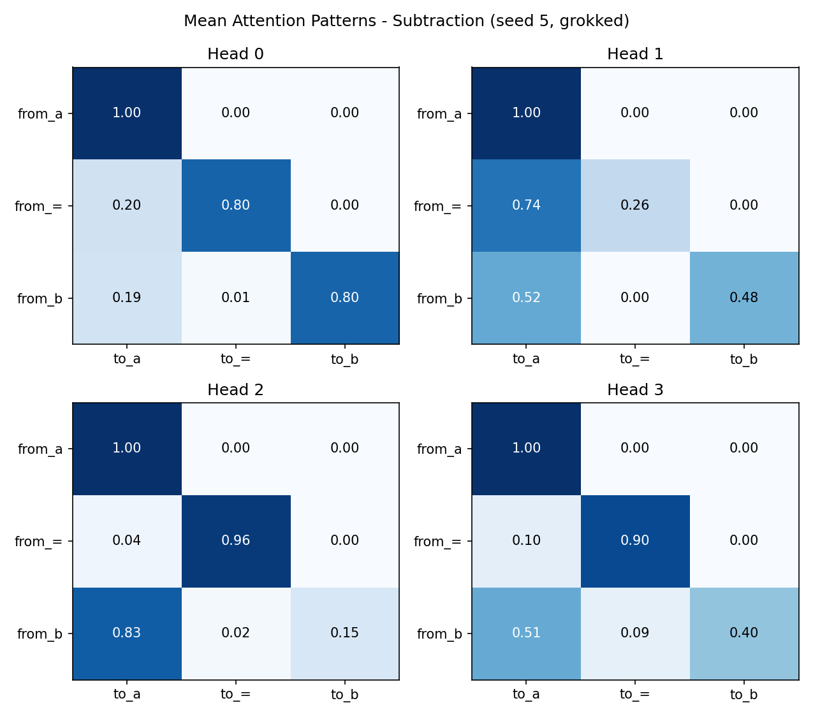
*Head 2 (top right) reads 0.83 to_a versus 0.15 to_b from pos_b, and Head 1 (top left, the dominant head by LDR) attends 0.74 to_a from the separator, exactly the row where addition heads attend nearly evenly. The asymmetry is concentrated in the heads that matter most for the answer.*

Subspace alignment (Frobenius norm of `U1.T @ U2` for the top-5 left singular vectors of OV and QK matrices, normalised by √5):

| Comparison                              | OV Alignment    | QK Alignment    |
| --------------------------------------- | --------------- | --------------- |
| Within addition (45 pairs), Head 2      | 0.194 ± 0.024   | 0.197 ± 0.021   |
| Addition vs subtraction5 (9 pairs), H2  | 0.194 ± 0.015   | 0.190 ± 0.017   |
| Addition Head 3 vs subtraction Head 1   | 0.193 ± 0.020   | 0.205 ± 0.032   |

Effective ranks (participation ratio `(Σs)² / Σs²`) of the OV matrices: addition seeds range 2.45 to 9.11 across all four heads, with most values in the 3–6 band; subtraction seed5 ranges 2.11 to 3.03. The subtraction circuit operates in a tighter subspace, but the rotation-invariant alignment metric cannot detect this difference because it sits below the noise floor.

### Extended Analysis

Each addition seed picks its own top-5 frequency set from the 57 available rfft frequencies, with no cross-seed consensus: seed0 uses {50, 54, 3, 13, 5}; seed1 uses {1, 23, 2, 46, 0}; seed7 uses {31, 1, 55, 51, 2}. Frequency overlap Jaccard between the addition mean top-5 and subtraction seed5 top-5 is 0.250 (shared frequencies: 20 and 39). The lack of a canonical frequency basis is the representational version of the weight-space rotational symmetry: every grokked model finds *a* Fourier basis, but not *the same* Fourier basis.

Attention asymmetry (`mean(attn_to_a) − mean(attn_to_b)` from pos_b) at Head 2:

| Model              | Asymmetry | z-score (vs addition) |
| ------------------ | --------- | --------------------- |
| Addition mean (n=9)| −0.001    | (μ ± σ = 0.072)       |
| Subtraction seed5  | +0.673    | +9.32                 |
| Subtraction seed2  | +0.205    | +2.84                 |
| Subtraction seed4  | −0.916    | −12.66                |

The opposite-direction near-miss seeds (seed2 leans to_a, seed4 leans to_b by even more than seed5 leans to_a) are the strongest evidence in the project that subtraction's loss landscape contains multiple competing attractors, only one of which sustains generalisation.

Causal scrubbing (forcing `pattern[:, 2, 2, :] = [0.5, 0.0, 0.5]` for Head 2 at the destination position):

| Condition                                        | Accuracy |
| ------------------------------------------------ | -------- |
| Subtraction seed5, baseline                      | 0.960    |
| Subtraction seed5, symmetric forced              | 0.175    |
| Subtraction seed5, accuracy drop                 | 0.785    |
| Addition control (mean of 9), accuracy drop      | 0.606 ± 0.106 |
| Drop ratio                                       | 1.29×    |
| Interpretation                                   | `asymmetry_partially_causal` |

The null intervention (replacing per-example attention with the head's *own* mean asymmetric pattern `[0.83, 0.02, 0.15]`) produced a 0.34 accuracy drop, which is itself informative: Head 2 uses input-dependent attention, not a fixed routing pattern, and the per-example deviations from the mean carry signal that the global mean cannot reconstruct.

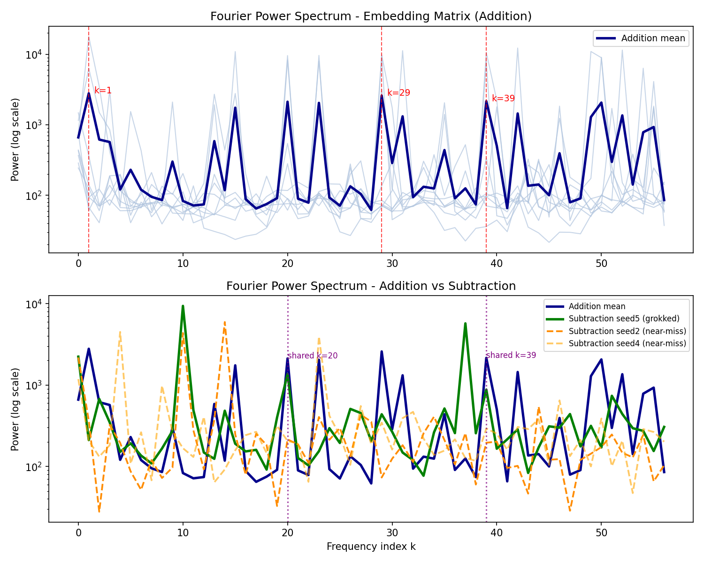
*Top: addition seeds (light blue) span very different frequency sets; the dark blue mean smooths over this idiosyncrasy and is not itself a real model. Bottom: subtraction seed5 (green) sits below the addition mean in concentration, and the near-miss seeds (orange) sit lower still. The two shared frequencies (20 and 39, marked) are the only basis overlap between tasks.*

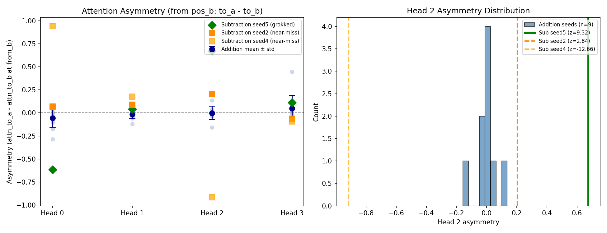
*Left: every addition seed clusters near zero asymmetry at every head; subtraction seed5 (green diamond at H2) and subtraction seed4 (lighter orange square at H2) lie on opposite sides of the addition distribution. Right: a histogram of Head 2 asymmetry across the 9 addition seeds, with the three subtraction models marked. Subtraction seed5 is 9.32 standard deviations above the addition mean.*

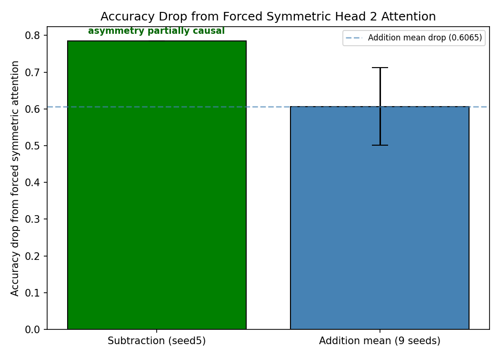
*Forcing Head 2 attention to be symmetric drops subtraction accuracy by 0.785 and addition accuracy by 0.606 ± 0.106 on average. The 1.29× ratio gives a `partially_causal` verdict: asymmetry contributes to subtraction's solution but is not strictly necessary, and addition is also not fully robust to the intervention because input-dependent variation around the symmetric mean carries information.*

### Circuit Evolution

Three checkpoint stages per grokked seed enable comparison of the same circuit at different points in training. Q1 (does the circuit form suddenly or gradually?): mean addition pre→grokked Jaccard = 0.667 ± 0.236, with seeds 0, 3, and 6 at Jaccard = 1.0 (top-3 cells unchanged across the entire transition) and the rest at 0.5; verdict `GRADUAL: circuit partially present before grokking`. Seed 7 is the most interesting outlier, with a pre-grokking top-3 of `[(H0, pos_b), (H2, pos_b), (H0, pos_=)]` that includes a non-pos_b cell (the only such case in any seed at any stage), suggesting the circuit briefly read from the separator position during memorisation before localising to pos_b. Q2 (is subtraction's asymmetry present at grokking or built up after?): subtraction seed5 asymmetry is 0.916 pre-grokking, 0.673 at grokking, 0.673 at final; verdict `PRESENT_AT_GROKKING: asymmetric circuit forms with grokking`. The asymmetry is *higher* in the memorisation phase and partially softens through the grokking transition, the opposite of what a standard "sudden circuit emergence" picture would predict. Q3 (does Fourier concentration sharpen at grokking?): addition mean concentration 0.578 → 0.737 (+0.159), subtraction seed5 0.363 → 0.520 (+0.157); verdict `YES`, with the two tasks showing nearly identical deltas despite their very different starting points. Q4 (post-grokking stability) is structurally trivial: the Phase 2 training script breaks immediately when grokking is confirmed, so the grokked and final checkpoints contain identical weights (`weight_l2_diff_grokked_final = 0.00` for every seed), which forces Q4's Jaccard to 1.000 by construction rather than by training dynamics.

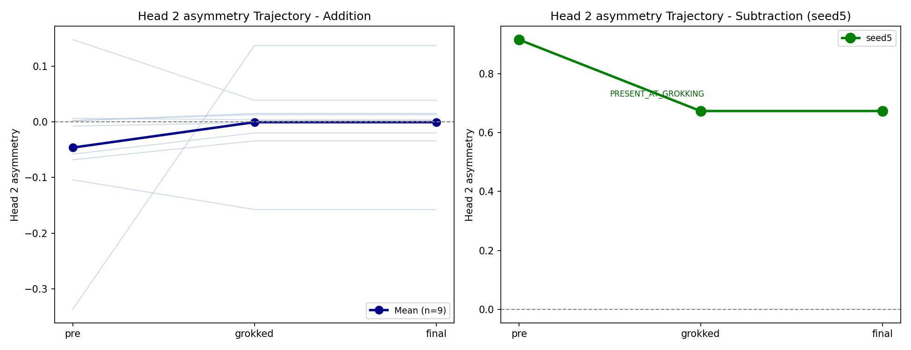
*Left: addition seeds (light blue) all hover near zero at every stage; the dark blue mean is essentially flat. Right: subtraction seed5 (green) starts at 0.916 in the memorisation phase and decreases to 0.673 at grokking. The asymmetry is a property of the memorisation attractor that grokking partially resolves, not a feature that grokking installs.*

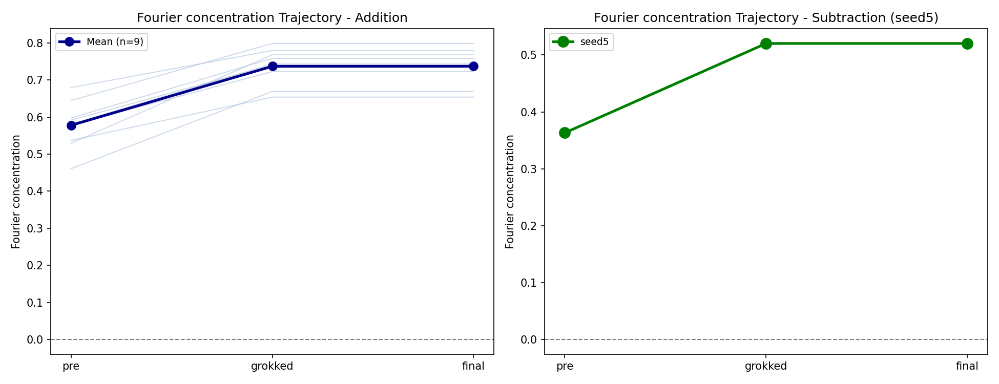
*Both tasks show concentration rising sharply at the grokking transition (mean delta ≈ +0.16). Subtraction starts and ends lower than addition at both stages, consistent with a tighter, more compressed Fourier basis that is harder to find from random initialization.*

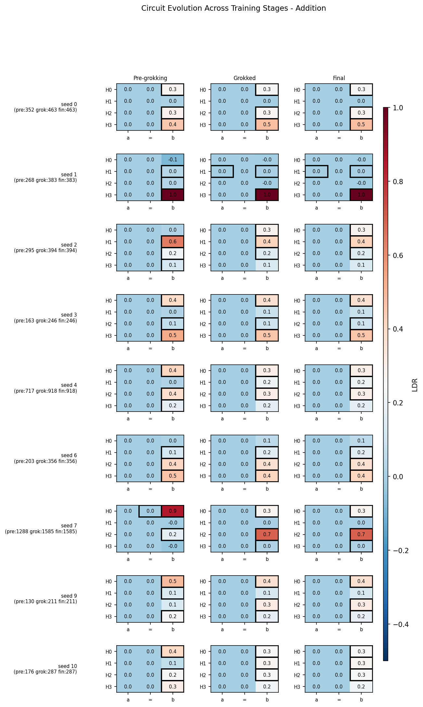
*Each row shows one seed at pre-grokking, grokked, and final. The grokked and final heatmaps are identical by construction (weights are unchanged); the pre-grokking heatmaps are visually similar to the grokked ones in head identity but differ in cell magnitudes. The circuit is largely already present in the memorisation phase; what grokking changes is the strength and clarity of the contributions, not the heads involved.*

### Anomalous Cases Worth Noting

Seed 7 is the slowest addition grokker at epoch 1,536, and it is also the only model in the project whose pre-grokking patching top-3 contains a non-pos_b cell: `(H0, pos_b), (H2, pos_b), (H0, pos_=)`. The pre-grokking H0 LDR at pos_b is 0.85, the highest single-head LDR recorded anywhere in the dataset, and it then drops to 0.27 at the grokked checkpoint while H2 rises to 0.69. This pattern is consistent with genuine circuit reorganisation rather than circuit refinement: seed 7 spent its long memorisation phase concentrating answer-relevant computation in a single head before redistributing it across multiple heads at the grokking transition.

Subtraction seed 4 is the strongest single piece of evidence in the project for why subtraction groks only 1 time in 10. It reached test accuracy 0.9247 and plateaued without satisfying the sustained-grokking criterion, and its Head 2 asymmetry of −0.916 (z=−12.66 against the addition distribution) is the most extreme value in the entire dataset in either direction: it attends to_b almost exclusively rather than to_a. Together with subtraction seed5 (asymmetry +0.673) and seed2 (asymmetry +0.205), this gives a clear picture of subtraction's loss landscape as containing at least two strongly asymmetric but structurally opposite memorisation basins, with seed 4 trapped in the mirror image of seed 5's grokked solution. Neither extreme produces stable grokking on its own; only the asymmetric basin that happens to align with the actual subtraction operation, the to_a-leaning one, sustains the threshold long enough to count.

## Training Challenges and Hyperparameter Decisions

This project initially trained all models with `weight_decay=1.0`, following Nanda et al. (2023), which identified weight decay as the primary driver of grokking in modular arithmetic tasks. Under this setting, addition models grokked reliably across seeds, with most seeds converging within a few hundred epochs. However, subtraction models showed severe instability: high initialization failure rates (seeds failing to reach `train_acc=0.50` by epoch 500), oscillatory behaviour near the grokking threshold that prevented the sustained-criterion from being satisfied, and plateau behaviour at `test_acc~0.87` with no further improvement across 5,000 epochs.

This asymmetry under `weight_decay=1.0` was itself an early finding, suggesting the two tasks have different loss landscape geometries under strong regularisation. However, to obtain a clean apples-to-apples circuit comparison with sufficient valid runs for both tasks, weight decay was reduced to 0.5. This decision was made deliberately rather than to obscure the asymmetry: if differences in grokking dynamics persist at `weight_decay=0.5`, they reflect genuine task-intrinsic properties rather than a regularisation artefact. If the asymmetry disappears, that itself is informative, indicating the `weight_decay=1.0` results were a regularisation effect rather than a circuit-formation effect. Both outcomes are reported.

All results reported in subsequent sections use `weight_decay=0.5` unless otherwise stated.

A second methodological challenge emerged during Phase 6 circuit evolution analysis. The original training script saved the grokked checkpoint at the epoch when the 50-consecutive-epoch sustain criterion was confirmed, then immediately saved the final checkpoint with identical weights; no parameter updates occurred between the two saves. This made the grokked and final checkpoints byte-identical, rendering the planned grokked-vs-final circuit comparison trivially uninformative (Jaccard=1.0 for all seeds). The root cause was a conflation between grokking_epoch (the first epoch where test_acc crossed 0.95) and the checkpoint-saving epoch (grokking_epoch + 49, after the confirmation window elapsed). To resolve this, the training script was modified to additionally save a pre-grokking checkpoint defined as the last epoch where test_acc remained below 0.5, capturing the model in its memorisation phase before the generalising circuit begins to form. All models were retrained with the corrected checkpointing logic. The pre-grokking checkpoint epoch field records the actual memorisation-phase epoch, and the grokked checkpoint epoch field was updated to reflect the true confirmation epoch rather than the first-crossing epoch. Weight L2 distance between pre-grokking and grokked checkpoints is reported per seed to verify the checkpoints capture a genuine training transition rather than a trivial difference.

## Reproducing the Results

Dependencies are managed with uv. Modular arithmetic datasets are generated from scratch by the first script. A GPU is recommended; this project was developed and tested on an RTX 3050 4GB. The scripts should be run in order:

1. `01_generate_data.py`: generate the addition and subtraction datasets at the pair-level split (seed 42, train_fraction=0.5)
2. `02_train_models.py`: train 10 valid seeds per task with the three-checkpoint scheme (~1–2 hours on GPU)
3. `03_logit_lens.py`: project residual stream states through the unembedding matrix at each position
4. `04_activation_patching.py`: per-head per-position LDR heatmaps and the cross-task patching experiment
5. `05_circuit_analysis.py`: SVD-based OV/QK subspace analysis and mean attention patterns
6. `05b_extended_analysis.py`: Fourier features, attention asymmetry quantification, causal scrubbing
7. `06_circuit_evolution.py`: three-stage comparison of pre-grokking vs grokked vs final checkpoints

```bash
uv sync
uv run python scripts/01_generate_data.py
uv run python scripts/02_train_models.py
uv run python scripts/03_logit_lens.py
uv run python scripts/04_activation_patching.py
uv run python scripts/05_circuit_analysis.py
uv run python scripts/05b_extended_analysis.py
uv run python scripts/06_circuit_evolution.py
```

## Limitations

Only one subtraction seed grokked under the chosen hyperparameters, so every subtraction circuit finding rests on n=1 and the cross-task generalisability of the subtraction circuit cannot be established from this work alone. Output patching at the attention layer measures only what each head *writes* to a destination position, not what it *reads* from a source position via attention, so the exactly-zero LDR values at pos_a and pos_= reflect the metric's blind spot as much as a real causal absence. The weight-space subspace alignment metric is rotation-invariant by construction and therefore cannot distinguish "shared circuit in a different basis" from "orthogonal circuit", which is why the alignment numbers sit at random baseline for both within-task and cross-task comparisons. The original `weight_decay=1.0` regime, documented in the Training Challenges section, was abandoned for sample-size reasons, so the most regularised version of the comparison cannot be reported with the same statistical resolution. Q4 of Phase 6 (post-grokking circuit stability) is structurally trivial because the training script terminates at the moment grokking is confirmed and the grokked and final checkpoints share identical weights, so the post-grokking transition cannot be measured without a script change that continues training past the confirmation point. Fast-grokking seeds (notably seed 9 at grokking epoch 162 with pre-grokking epoch 130) have only 32 epochs of memorisation-phase data, which limits how representative the pre-grokking checkpoint is for those seeds. The Fourier frequency idiosyncrasy means no canonical frequency basis can be reported across seeds, only the per-seed top-5 sets; aggregate spectra are statistical artefacts of averaging non-aligned bases and should not be treated as a real model. Cross-task patching pairs each of the 9 grokked addition models against the single grokked subtraction model in an asymmetric design, so the cross-task LDR averages are 9-vs-1 in their statistical leverage and should be read as an upper bound on transferability rather than a balanced two-way comparison.

## Dependencies

| Package          | Purpose                                                                |
| ---------------- | ---------------------------------------------------------------------- |
| torch            | Model weights, training loop, tensor operations                        |
| transformer-lens | HookedTransformer architecture, hooks, run_with_cache, run_with_hooks  |
| numpy            | Aggregate statistics, heatmap arithmetic, np.fft fallback              |
| scipy            | Spearman z-scores for attention asymmetry significance testing         |
| matplotlib       | All plots (grokking curves, heatmaps, trajectories, spectra)           |
| einops           | Per-head attention contribution decomposition (`hook_z @ W_O[h]`)      |

## References

Nanda, N., Chan, L., Lieberum, T., Smith, J., and Steinhardt, J. (2023). *Progress measures for grokking via mechanistic interpretability.* ICLR 2023.

Power, A., Burda, Y., Edwards, H., Babuschkin, I., and Misra, V. (2022). *Grokking: Generalization beyond overfitting on small algorithmic datasets.* arXiv:2201.02177.

Varma, V., Shah, R., Kenton, Z., Kramár, J., and Kumar, R. (2023). *Explaining grokking through circuit efficiency.* arXiv:2309.02390.

Elhage, N., et al. (2021). *A mathematical framework for transformer circuits.* Transformer Circuits Thread.

Conmy, A., Mavor-Parker, A., Lynch, A., Heimersheim, S., and Garriga-Alonso, A. (2023). *Towards automated circuit discovery for mechanistic interpretability.* NeurIPS 2023.
